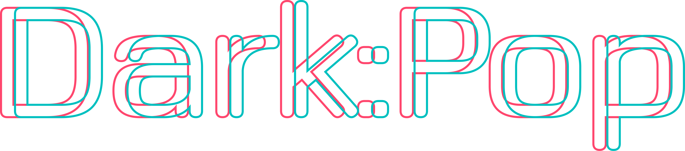
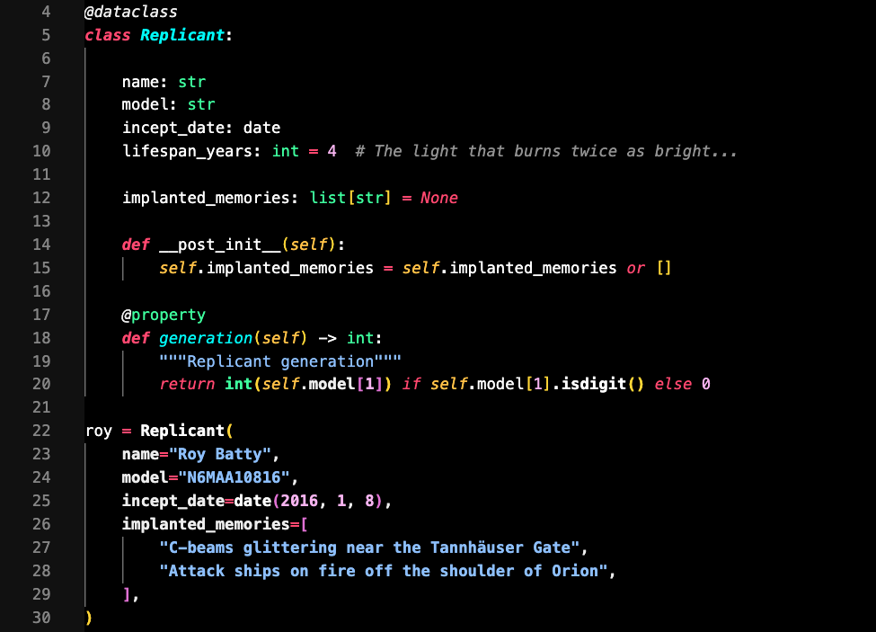
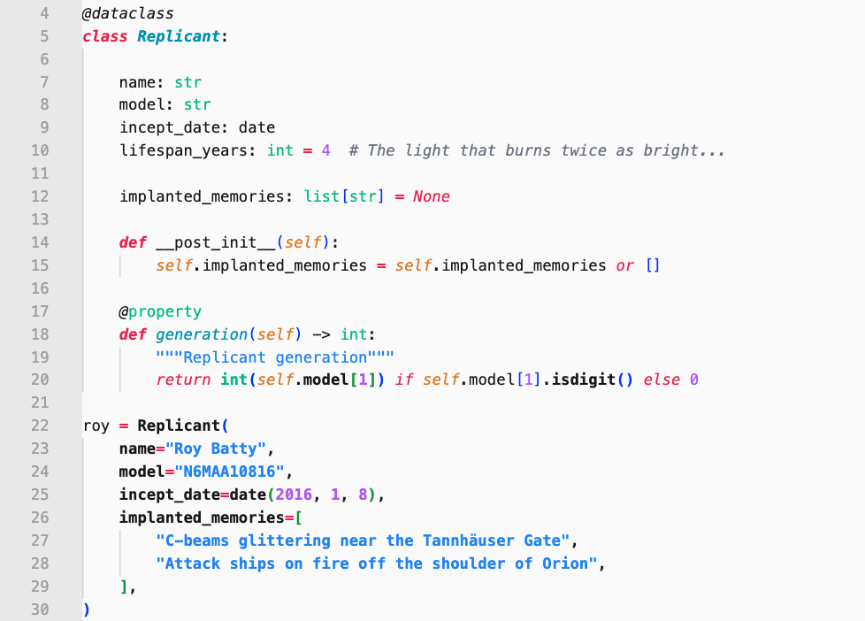

  

<h2 align="center">
  A multi-purpose theme. Probably compatible with your favorite editor.
</h3>

## Screenshots

 

## Variants

Comes in 5 flavors: **DarkPop** (White / Gold / Mint / Blue) and **LightPop** (Gold)

## Installation

### VS Code

**Option 1: Marketplace** (coming soon)
- Search for "Pop Theme" in the Extensions sidebar

**Option 2: Manual Install**
1. Download the `.vsix` file from [Releases](../../releases)
2. In VS Code: `Cmd+Shift+P` → "Install from VSIX"
3. Select the downloaded file
4. `Cmd+K Cmd+T` → Choose your Pop Theme variant

### iTerm2

1. Download the `.itermcolors` file for your preferred variant
2. Open iTerm2 → **Preferences** → **Profiles** → **Colors**
3. Click **Color Presets...** → **Import...**
4. Select the downloaded file
5. Click **Color Presets...** again → Select the imported theme

### Sublime Text

1. Download `DarkPop.tmTheme` and `DarkPop.sublime-theme`
2. Place in your Sublime Text `Packages/User` directory
3. **Preferences** → **Select Color Scheme** → Choose DarkPop

### TextMate / BBEdit

1. Download `DarkPop.tmTheme`
2. Double-click to install, or place in the appropriate themes directory

### Zed

1. Download the `.tmTheme` file from the `textmate/` folder
2. Place in `~/.config/zed/themes/`
3. Open Zed → **Settings** → Select the theme

### Notepad++

1. Download the `.xml` file for your preferred variant from `notepadpp/`
2. Place in `%APPDATA%\Notepad++\themes\`
3. Restart Notepad++ → **Settings** → **Style Configurator** → Select theme

### JetBrains IDEs

1. Download the `.icls` file for your preferred variant from `jetbrains/`
2. **File** → **Settings** → **Editor** → **Color Scheme** → ⚙️ → **Import Scheme**
3. Select the downloaded file

## License

MIT

